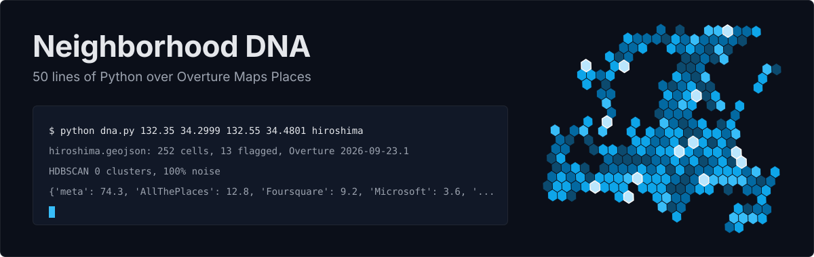
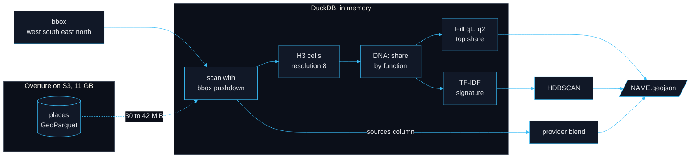
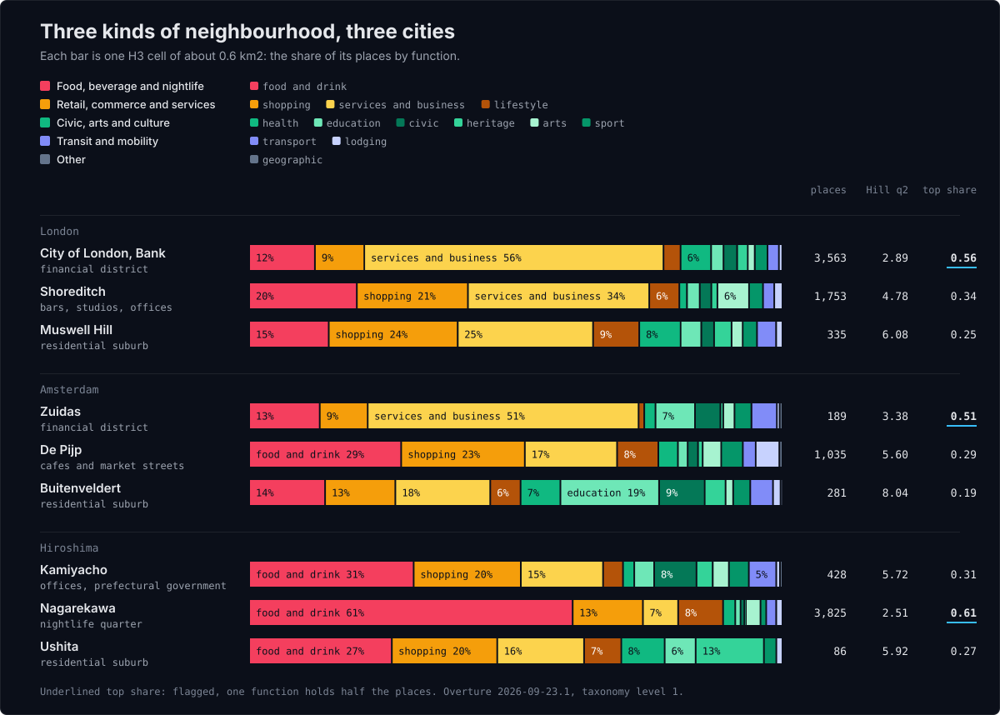
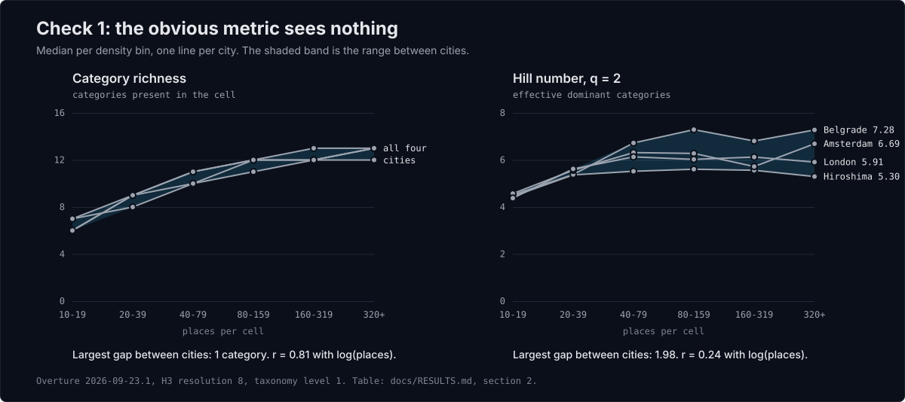
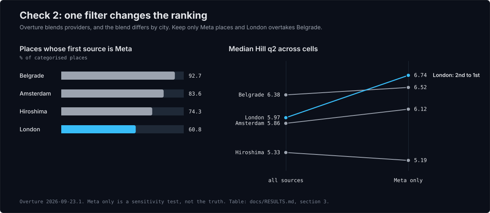

<p align="center">
  
</p>

<p align="center">
  <a href="https://github.com/m-erts/neighborhood-dna/actions/workflows/ci.yml"></a>
  
  
  
  <a href="LICENSE"></a>
  <a href="docs/LICENSE.md"></a>
</p>

# Neighborhood DNA

Give it a bounding box. It returns the functional profile of every
neighbourhood inside: what share of the places are restaurants, shops, offices,
clinics or schools, and how mixed each block is. The pipeline is
[50 lines of Python](dna.py). DuckDB reads
[Overture Maps Places](https://docs.overturemaps.org/guides/places/) where it
lies on S3 and fetches about 30 MB of an 11 GB release, so there is nothing to
download and no GIS stack to install.

```bash
python dna.py 132.35 34.2999 132.55 34.4801 hiroshima
```

```text
hiroshima.geojson: 252 cells, 13 flagged, Overture 2026-09-23.1
HDBSCAN 0 clusters, 100% noise
{'meta': 74.3, 'AllThePlaces': 12.8, 'Foursquare': 9.2, 'Microsoft': 3.6, 'PinMeTo': 0.0, 'DAC': 0.0}
```

Thirteen of Hiroshima's 252 cells are flagged: one function holds half the
places there. A planner can walk a list that short, and it is where a
mixed-use programme would start.

This is the code behind a lightning talk at FOSS4G Hiroshima 2026,
[50 Lines of Python: Neighborhood DNA from Overture Maps Places](https://talks.osgeo.org/foss4g-2026/talk/ERGRGW/).
The talk had one message: any POI dataset will answer wrong twice, and open
data is the kind that lets you catch it. Both checks are in this repository,
next to [everything I got wrong](CAVEATS.md).

## Quick start

```bash
git clone https://github.com/m-erts/neighborhood-dna && cd neighborhood-dna
pip install -r requirements.txt        # Python 3.12 or newer
python dna.py 132.35 34.2999 132.55 34.4801 hiroshima
```

With [uv](https://docs.astral.sh/uv/) there is no install step, because the
script declares its own dependencies:

```bash
uv run dna.py 132.35 34.2999 132.55 34.4801 hiroshima
```

The arguments are `WEST SOUTH EAST NORTH NAME`, in degrees, then an optional
release or a local parquet file:

```bash
python dna.py -0.22 51.3906 -0.02 51.6294 london                  # newest release on S3
python dna.py -0.22 51.3906 -0.02 51.6294 london 2026-08-19.0     # a release you name
python dna.py -0.22 51.3906 -0.02 51.6294 london london.parquet   # your own extract, offline
```

Boxes that were run for this README, all on release `2026-09-23.1`:

| city | `WEST SOUTH EAST NORTH` | cells | flagged | largest provider |
| --- | --- | ---: | ---: | --- |
| Hiroshima | `132.35 34.2999 132.55 34.4801` | 252 | 13 | Meta 74.3% |
| Belgrade | `20.35 44.7002 20.55 44.9098` | 216 | 10 | Meta 92.7% |
| Amsterdam | `4.8 52.2483 5.0 52.4917` | 360 | 39 | Meta 83.6% |
| London | `-0.22 51.3906 -0.02 51.6294` | 586 | 15 | Meta 60.8% |
| Nairobi | `36.75 -1.34 36.92 -1.22` | 261 | 18 | Meta 96.6% |
| São Paulo | `-46.70 -23.60 -46.58 -23.50` | 209 | 10 | Meta 93.3% |
| Manhattan | `-74.03 40.70 -73.93 40.80` | 130 | 25 | BrightQuery 45.1% |
| Sydney | `151.15 -33.92 151.28 -33.82` | 149 | 7 | Meta 64.9% |

To look at the result, drop the GeoJSON on the
[interactive map](https://m-erts.github.io/neighborhood-dna/demo.html), open it
in QGIS or kepler.gl, or run `python view.py hiroshima.geojson` after
`pip install ".[viz]"`.

## How it works



1. **Scan.** The filter on `bbox.xmin` and `bbox.ymin` compares plain numbers,
   so DuckDB reads the parquet footers, skips every row group that cannot
   match and fetches the rest over HTTP range requests. The geometry column is
   never opened.
2. **Cells.** Each place goes into the H3 cell under it. Cells with fewer than
   10 categorised places are dropped.
3. **DNA.** The share of each of the 13 top-level functions in the cell.
4. **Metrics.** Hill numbers and the top share, all of them sums over the
   shares, so they are computed in SQL.
5. **Signature and clusters.** TF-IDF weights the shares by how rare a
   function is across the box; HDBSCAN looks for groups of similar cells.
6. **GeoJSON.** One hexagon per cell, with the provider blend of the box in
   the metadata.

Formulas and definitions: [docs/METHODOLOGY.md](docs/METHODOLOGY.md).

## The 50 lines

The file is 72 lines long: 50 lines of code, the rest is the docstring,
comments and blank lines. A test counts them on every commit.

<!-- dna.py:start -->
```python
#!/usr/bin/env python3
# /// script
# requires-python = ">=3.11"
# dependencies = ["duckdb==1.5.6", "scikit-learn==1.9.1"]
# ///
"""Neighborhood DNA from Overture Maps Places. FOSS4G Hiroshima 2026.

    python dna.py WEST SOUTH EAST NORTH NAME [RELEASE | extract.parquet]
    python dna.py 132.35 34.30 132.55 34.48 hiroshima

Writes NAME.geojson: one H3 cell per feature with its category shares (the
DNA), Hill numbers, TF-IDF signature and HDBSCAN label. Nothing is downloaded:
DuckDB reads the parquet on S3 and pushes the bbox filter down to storage.
"""
import json
import sys

import duckdb
from sklearn.cluster import HDBSCAN

S3 = "s3://overturemaps-us-west-2/release"
# H3_RES 8: hexagons of 0.6-0.8 km2, the area drifts with location (CAVEATS 4).
# LEVEL 1: the 13 top branches of the taxonomy; 2 gives ~125 groups.
# MIN_POI 10: below that the diversity metrics are sampling noise.
H3_RES, LEVEL, MIN_POI = 8, 1, 10

west, south, east, north, name = *map(float, sys.argv[1:5]), sys.argv[5]
if not (-180 <= west < east <= 180 and -90 <= south < north <= 90):
    sys.exit("bbox order is WEST SOUTH EAST NORTH (lon lat lon lat)")

duckdb.sql("INSTALL httpfs; LOAD httpfs; INSTALL spatial; LOAD spatial; SET http_retries = 6;"
           "INSTALL h3 FROM community; LOAD h3; SET s3_region = 'us-west-2';")
source = sys.argv[6] if len(sys.argv) > 6 else max(  # default: the newest release on S3
    path.split("/")[4] for path, in duckdb.sql(f"FROM glob('{S3}/*/theme=places/*/*')").fetchall())
files = source if source.endswith(".parquet") else f"{S3}/{source}/theme=places/type=place/*"
duckdb.sql(f"""CREATE TABLE places AS
SELECT h3_latlng_to_cell(bbox.ymin, bbox.xmin, {H3_RES}) AS cell, sources[1].dataset AS provider,
       taxonomy.hierarchy[least({LEVEL}, len(taxonomy.hierarchy))] AS category
FROM read_parquet('{files}') WHERE len(taxonomy.hierarchy) > 0
 AND bbox.xmin BETWEEN {west} AND {east} AND bbox.ymin BETWEEN {south} AND {north}""")

cells = duckdb.sql(f"""WITH shares AS (
    SELECT cell, category, n / sum(n) OVER c AS p, sum(n) OVER c AS poi
    FROM (SELECT cell, category, count(*)::DOUBLE AS n FROM places GROUP BY ALL)
    WINDOW c AS (PARTITION BY cell) QUALIFY poi >= {MIN_POI}
), weighted AS (  -- TF-IDF: share in the cell x smoothed inverse cell frequency
    SELECT *, p * (1 + ln((1 + count(DISTINCT cell) OVER ()) / (1 + count(*) OVER k))) AS w
    FROM shares WINDOW k AS (PARTITION BY category))
SELECT ST_AsGeoJSON(ST_GeomFromText(h3_cell_to_boundary_wkt(cell))) AS geometry,
       h3_h3_to_string(cell) AS h3, any_value(poi)::INT AS poi, count(*) AS richness,
       round(exp(-sum(p * ln(p))), 3) AS hill_q1, round(1 / sum(p * p), 3) AS hill_q2,
       round(max(p), 3) AS top_share, max(p) >= 0.5 AS flagged,
       first(category ORDER BY p DESC, category) AS dominant,  -- ties: alphabetical
       map_from_entries(list((category, round(p, 3)) ORDER BY p DESC, category)) AS dna,
       map_from_entries(list((category, round(w, 3)) ORDER BY w DESC, category)) AS tfidf
FROM weighted GROUP BY cell ORDER BY h3""")
cells = [dict(zip(cells.columns, row)) for row in cells.fetchall()]
if len(cells) < 10:
    sys.exit(f"only {len(cells)} cells hold {MIN_POI}+ categorised places: widen the bbox")
categories = sorted({category for cell in cells for category in cell["dna"]})
labels = HDBSCAN(min_cluster_size=10, copy=True).fit_predict(
    [[cell["tfidf"].get(category, 0) for category in categories] for cell in cells])
blend = dict(duckdb.sql("""SELECT provider, round(100 * count(*) / sum(count(*)) OVER (), 1)
                           FROM places GROUP BY 1 ORDER BY 2 DESC""").fetchall())
meta = dict(source=source, bbox=[west, south, east, north], h3_res=H3_RES,
            taxonomy_level=LEVEL, min_poi=MIN_POI, providers_pct=blend)
features = [dict(type="Feature", geometry=json.loads(cell.pop("geometry")),
                 properties=dict(cell, cluster=int(label))) for cell, label in zip(cells, labels)]
with open(f"{name}.geojson", "w") as out:
    json.dump(dict(type="FeatureCollection", metadata=meta, features=features), out)
print(f"{name}.geojson: {len(cells)} cells, {sum(c['flagged'] for c in cells)} flagged, Overture "
      f"{source}\nHDBSCAN {labels.max() + 1} clusters, {(labels < 0).mean():.0%} noise\n{blend}")
```
<!-- dna.py:end -->

## What comes out

Each feature of `NAME.geojson` is one H3 cell.

| property | meaning |
| --- | --- |
| `h3` | index of the cell, resolution 8 |
| `poi` | categorised places in the cell |
| `dna` | share of each function, largest first |
| `hill_q1` | effective number of functions, `exp(−Σ p ln p)` |
| `hill_q2` | effective number of dominant functions, `1 / Σ p²` |
| `top_share` | share of the largest function |
| `flagged` | `true` when `top_share` is 0.5 or more |
| `dominant` | the largest function; ties break alphabetically |
| `richness` | functions present. Kept to show why it misleads, see check 1 |
| `tfidf` | the signature: shares weighted by rarity across the box |
| `cluster` | HDBSCAN label, `-1` for noise |

The collection also carries `metadata`: the release, the bbox, the parameters
and `providers_pct`, the share of each data provider in the box.

## Three kinds of neighbourhood

<p align="center">
  
</p>

| city | district | known as | places | Hill q2 | top share | leading functions |
| --- | --- | --- | ---: | ---: | ---: | --- |
| London | City of London, Bank | financial district | 3,563 | 2.89 | **0.56** | services and business 56%, food and drink 12% |
| London | Shoreditch | bars, studios, offices | 1,753 | 4.78 | 0.34 | services and business 34%, shopping 21% |
| London | Muswell Hill | residential suburb | 335 | 6.08 | 0.25 | services and business 25%, shopping 24% |
| Amsterdam | Zuidas | financial district | 189 | 3.38 | **0.51** | services and business 51%, food and drink 13% |
| Amsterdam | De Pijp | cafes and market streets | 1,035 | 5.60 | 0.29 | food and drink 29%, shopping 23% |
| Amsterdam | Buitenveldert | residential suburb | 281 | 8.04 | 0.19 | education 19%, services and business 18% |
| Hiroshima | Kamiyacho | offices, prefectural government | 428 | 5.72 | 0.31 | food and drink 31%, shopping 20% |
| Hiroshima | Nagarekawa | nightlife quarter | 3,825 | 2.51 | **0.61** | food and drink 61%, shopping 13% |
| Hiroshima | Ushita | residential suburb | 86 | 5.92 | 0.27 | food and drink 27%, shopping 20% |

Each row is one H3 cell, the one under a point inside the neighbourhood.
Bold top shares are flagged.

Three things show up.

The business districts of London and Amsterdam have the same signature. More
than half of their places are services and business, and about three
functions carry the cell.

Mono-functional does not mean offices. In Hiroshima the flagged cell is the
nightlife quarter, where 61% of 3,825 places serve food and drink.
Kamiyacho, the office district next to it, is mixed.

The residential suburbs are the most mixed cells in the table and the
emptiest. A POI dataset has no homes in it, so a dormitory district reads as a
handful of shops, a school and a clinic in even proportions. Read the mix
together with the place count: Muswell Hill and the City of London differ by a
factor of ten in places before they differ in anything else.

## Two checks before you trust a number

### 1. Control for cell size

<p align="center">
  
</p>

The obvious metric is the number of categories present in a cell. It
correlates with the number of places at r = 0.81, and inside a density bin the
four cities never differ by more than one category. It measures how much data
landed in the cell. Hill q2 correlates at 0.24 and separates the cities by up
to 1.98 effective categories.

### 2. Check the sources column

<p align="center">
  
</p>

Overture blends providers and records the provider of every place. Belgrade is
92.7% Meta, London 60.8%, Manhattan 45.1% BrightQuery. Keep only Meta places
and London's median Hill q2 goes from 5.97 to 6.74, past Belgrade. Part of the
difference between two cities is a difference between two data pipelines.
`dna.py` prints the blend of your box on every run.

All tables: [docs/RESULTS.md](docs/RESULTS.md).

## Is there a typology?

The abstract of the talk promised one. HDBSCAN says no.

| signature, `min_cluster_size` | Hiroshima | Belgrade | Amsterdam | London |
| --- | --- | --- | --- | --- |
| TF-IDF, 5 | 0 clusters, 100% noise | 2 clusters, 88% noise | 2 clusters, 49% noise | 2 clusters, 84% noise |
| TF-IDF, 10 (what `dna.py` runs) | 0 clusters, 100% noise | 0 clusters, 100% noise | 0 clusters, 100% noise | 0 clusters, 100% noise |
| TF-IDF, 25 | 0 clusters, 100% noise | 0 clusters, 100% noise | 0 clusters, 100% noise | 0 clusters, 100% noise |

At the scale of a 0.6 km² cell the function mix of a city is a continuum and
has no natural classes. The step stays in the pipeline because your city may
differ, and because a method that answers "nothing clusters here" has done
its job. To sort cells into types, use declared thresholds: the dominant
function and the flag at a top share of 0.5.

## Data benchmark

| | Hiroshima | Belgrade | Amsterdam | London |
| --- | ---: | ---: | ---: | ---: |
| **Coverage** | | | | |
| places in the 366 km² box | 25,896 | 33,718 | 51,683 | 233,119 |
| with a category | 98.4% | 96.0% | 97.1% | 92.5% |
| cells with 10 places or more | 252 of 457 | 216 of 357 | 360 of 542 | 586 of 609 |
| places inside those cells | 97.2% | 98.3% | 98.7% | 100.0% |
| places with confidence under 0.5 | 7.4% | 31.8% | 25.9% | 19.7% |
| **Spatial resolution** | | | | |
| unit | H3 res 8 | H3 res 8 | H3 res 8 | H3 res 8 |
| mean cell area, km² | 0.58 | 0.78 | 0.62 | 0.66 |
| **Latency** | | | | |
| median `update_time` of a record | 14 Sep 2026 | 14 Sep 2026 | 14 Sep 2026 | 14 Sep 2026 |
| **Access** | | | | |
| read from S3, MiB | 31.0 | 30.5 | 32.0 | 41.8 |
| `dna.py` end to end, seconds | 17.2 | 12.0 | 10.3 | 11.9 |

Release `2026-09-23.1` holds 81,455,423 places in 16 files, 11.0 GB. The
bucket is public: no account, no key, no request form. Overture publishes
monthly and deletes a release after 60 days, which is the one access
constraint that matters (see Reproduce). `update_time` is the date of the
provider's delivery and says nothing about when somebody last saw the place.

The spatial unit is yours to choose, because the data are points: hexagons
here, city blocks or districts if you join them to your own polygons. A
gridded source, such as a 1 km² census or mobile-operator mesh, fixes the unit
for you.

## Cost

Measured on 29 September 2026 on a MacBook (Apple M5, 16 GB, macOS 26.5,
Python 3.13.9, DuckDB 1.5.6) over a home connection. Every scan was cold.

| | MiB read | HTTP requests | seconds |
| --- | ---: | ---: | ---: |
| scan one city | 30.5 to 41.8 | 45 to 113 | 7 to 18 |
| `dna.py`, S3 to GeoJSON | | | 10 to 17 |
| `checks.py`, every table, from local extracts | | | 12 |
| offline tests | 0 | 0 | 6 |

Peak memory is 0.65 GB for Hiroshima and 0.67 GB for London. No GDAL, GEOS or
PROJ is installed: DuckDB brings its own spatial and H3 extensions and fetches
them on the first run. Rerun the measurement with `python cost.py`.

## Reproduce

```bash
pip install -e ".[dev]"     # or: conda env create -f environment.yml
make all                    # cities, checks, cost, figures and slides, lint, tests
```

| target | what it does | needs S3 |
| --- | --- | --- |
| `make cities` | `dna.py` for the four test cities into `docs/data/` | yes |
| `make results` | `checks.py`: every table of `docs/RESULTS.md` | first run only |
| `make cost` | megabytes and seconds per city | yes |
| `make slides` | figures and `docs/index.html` from the data | no |
| `make test` | offline tests on a synthetic extract | no |
| `make live` | runs `dna.py` against the newest release | yes |

Versions are pinned exactly in [requirements.txt](requirements.txt) and
[pyproject.toml](pyproject.toml).

**Keep your extract.** Overture deletes a release after 60 days. The release
the talk used, `2026-07-22.0`, was no longer on S3 on 29 September, four weeks
after the talk, so the numbers on the stage slides cannot be recomputed.
`checks.py` saves one parquet extract per city in `data/` (2 to 22 MB), and
`dna.py` runs on such a file offline. Archive the extracts with your results.

Everything here is recomputed on `2026-09-23.1`. Against the stage slides the
median Hill q2 of each city moved by less than 3%, and the count of flagged
cells by up to three cells per city. Both checks came out the same way. The
comparison, number by number, is section 8 of
[docs/RESULTS.md](docs/RESULTS.md).

A weekly CI job runs the script against the newest release, so the next change
to the Overture schema will show up as a red badge here first.

## Caveats

The full list is in [CAVEATS.md](CAVEATS.md). The ones that change decisions:

- H3 cells are not equal-area. The mean cell is 0.58 km² in Hiroshima and
  0.78 km² in Belgrade. I said otherwise on stage.
- The shortlist moves between releases. Hiroshima had 16 flagged cells in
  August and 13 in September.
- Nothing is filtered on confidence. A third of Belgrade's places score under
  0.5.
- A POI dataset contains no housing, so residential areas look mixed.
- The taxonomy level, the H3 resolution and the threshold of 10 places are
  dials. Print them next to every number.

## Talk and slides

- Slides, rebuilt from the data: <https://m-erts.github.io/neighborhood-dna/>
- Interactive map: <https://m-erts.github.io/neighborhood-dna/demo.html>
- [Slides as delivered on stage](docs/slides-as-delivered.pdf) (PDF, release `2026-07-22.0`)
- [The talk in the conference schedule](https://talks.osgeo.org/foss4g-2026/talk/ERGRGW/),
  [speaker profile](https://talks.osgeo.org/foss4g-2026/speaker/9SBVXW/)

FOSS4G Hiroshima 2026, lightning talk, 2 September 2026, room Ran1.

## Cite

```bibtex
@misc{ercegovac2026dna,
  author       = {Ercegovac, Marija},
  title        = {50 Lines of Python: Neighborhood DNA from Overture Maps Places},
  howpublished = {Lightning talk, FOSS4G Hiroshima 2026, Hiroshima, Japan},
  month        = sep,
  year         = {2026},
  url          = {https://talks.osgeo.org/foss4g-2026/talk/ERGRGW/},
  note         = {Code: https://github.com/m-erts/neighborhood-dna}
}
```

GitHub builds other formats from [CITATION.cff](CITATION.cff): use "Cite this
repository" in the sidebar.

## Licence and attribution

Code: [MIT](LICENSE). Slides, figures and texts: [CC BY 4.0](docs/LICENSE.md).

Data: [Overture Maps Foundation](https://overturemaps.org/), places theme.
Every place carries the licence of its source. In the four test cities these
are CDLA-Permissive-2.0 (Meta, Microsoft, PinMeTo and others), Apache-2.0
(Foursquare) and CC0-1.0 (AllThePlaces). See
[Overture attribution](https://docs.overturemaps.org/attribution/).

Hill numbers: Hill (1973), [doi:10.2307/1934352](https://doi.org/10.2307/1934352).
Their behaviour under unequal sampling: Chao and Jost (2012),
[doi:10.1890/11-1952.1](https://doi.org/10.1890/11-1952.1).
